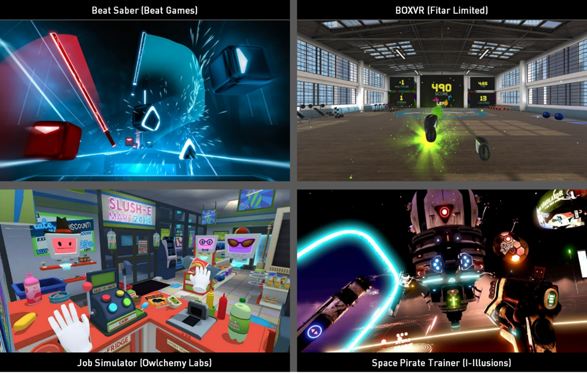
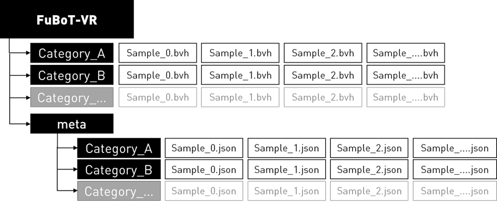

# FuBoT-VR Dataset

FuBoT-VR or VR Games Full-Body motion tracking dataset is a captured motion dataset of a single person playing four VR games during about 3 hours of play time. The dataset was originally created and used for a Master Thesis to train and evaluate a Data Driven Inverse Kinematics system (DNIK) for Virtual Reality. Afterwards I decided to make the dataset publicly available for use in other research or projects. 

More info about the Data Driven Inverse Kinematics system, or DNIK, can be found [here](https://edubuas-my.sharepoint.com/:b:/g/personal/204354_buas_nl/Ea7vM60RzQZBu6uib6YnGZkBSK-WE25cj45EO-K70u6WnQ?e=GrgWzU) (Master Thesis). 

## Categories

All motion is captured with an inertial motion capture suit, the [Rokoko Smartsuit Pro](https://www.rokoko.com/). The motions captured by the suit are retargeted to a predefined humanoid rig of 22 independent joints, and after retargeting, all baseline motion was saved in the BVH (Biovision Hierarchy) standard file format

The FuBoT-VR dataset is comprised of a total of 191 minutes of game play, and 344465 frames (30 per second). At the moment, the dataset only contains captured data from a single person. I hope to expand the dataset to include a more diverse set of body-types in the future.

Four different VR game types were selected that focus on different types of movement, namely:

 - **Generic** - a small number of movements not linked with games, like idle, walking, drinking coffee, stretching. (**1.9%**)
 - **[Beatsaber](https://beatsaber.com/)** - a VR rhythm game that contains sword-like slashing and evasive movements. (**24.2%**)
 - **[BoxVR](https://store.steampowered.com/app/641960/BOXVR/)** - a VR fitness game with upperbody boxing movements and squats. (**22.3%**)
 - **[Job Simulator](https://jobsimulatorgame.com/)** - a VR simulator game with general movements, interactions and locomotion (**31.6%**)
 - **[Space Pirate Trainer](https://www.spacepiratetrainer.com/)** - a VR fast paced classic shooter with dodging maneuvres. (**20.0%**)

|  | 
|:--:| 
| **Figure 1.** FuBoT-VR - Game Categories |

## Format
All captured motion is stored using the BVH file format. The BVH file format is a common format used for motion capture data storage. For every category there are multiple captured sequences available of variable length. All motion sequences are stored by category following a predefined file structure as shown in **Figure 2**. For every sequence, a seperate and corresponding JSON metafile is available containing additional informatioin about the sequence itself.

|  | 
|:--:| 
| **Figure 2.** FuBoT-VR dataset - source motioin file structure |

Depending on the use-case, the FuBoT-VR dataset can be further split up into smaller chunks and randomized subsets. These chunks can then serve as a starting point to generate the required AI training and/or comparison data. Tools are available to automatically chunk up this source dataset into smaller randomized subsets.

## Tools
Next to the motion data, some tools are available to preprocess the data
### Subset Generator

One of these is a tool to split up the FuBoT-VR source motion into smaller chunks and randomly distribute these into different subsets (training, validation and testing). There is also the option to generate machine learning input and outputs.
A configuration file is required to use this tool, some examples of these configuration files can be found in the tools folder.

Running the tool with a given configuration file:

    python fubot_generator.py config_default6p.json

All generator specifications (chunksize, split ratios, in/out features, ...) can be altered in the configuration file.
Some additional information about some parameters:
|Parameter|Information  |
|--|--|
| fubot_root | Path to the FuBoT-VR root folder |
| output_root | Path to the output root folder |
| output_name | Name of the generated dataset (will also be used as subfolder name) |
| split | Parameters and directives on how to split the source data |
| split/categories | Names and amount of required subsets |
| split/ratios | Ratios of each category (list size should match amount of categories) |
| split/min_chunk_size | Minimum size of a single chunk |
| split/max_chunk_size | Maximum size of a single chunk |
| split/seed | Seed used for the random generator (subset distribution) |
| training | Parameters and directives about the generated training data |
| training/input_features | Description and order of the input features |
| training/output_features| Description and order of the output features |
| *feature* | "*{joint_name}*" , "*{alternative_name}*" , "[ *{feature_data}* ]" |
| *feature_data* | *{component_type}* [ *{elements}* ] _ *{space}* |
| *feature_data/component_type* | Can be any of the following: **pos** (positionXYZ), **rot** (eulerXYZ), **qrot** (quaternionWXYZ) |
| *feature_data/elements* | Can be any combination or order of **W, X, Y, Z** |
| *feature_data/space* | Can be any of the following: **w** (world space), **l** (local space) |

### Ubisoft La Forge Animation Dataset converter
coming soon!

## WIP

There are plans to further expand the dataset with relevant motion captured from multiple persons.
Currently working on some scripts to automically convert the [Ubisoft La Forge animation dataset](https://github.com/ubisoft/ubisoft-laforge-animation-dataset) into the FuBoT-VR file structure. This way it can be imported as a seperate category and used as an extension on the original FuBoT-VR motion data.
